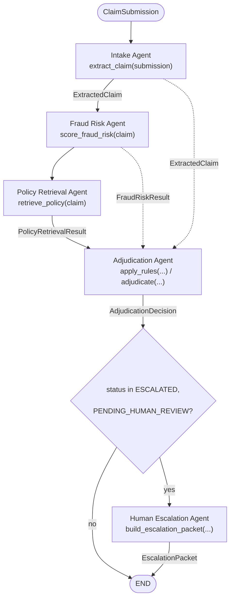

# Claims Triage — Build Plan

Phased implementation plan for the pipeline described in [`README.md`](README.md).
Each phase below maps to one or more TODO-stubbed files — signatures and
docstrings are in place, logic is not. Implement in order; later phases
depend on earlier ones.

## Pipeline Overview



| Agent | Function | Input(s) | Output |
|---|---|---|---|
| Intake | `extract_claim(submission)` | `ClaimSubmission` | `ExtractedClaim` |
| Policy Retrieval | `retrieve_policy(claim)` | `ExtractedClaim` | `PolicyRetrievalResult` |
| Fraud Risk | `score_fraud_risk(claim)` | `ExtractedClaim` | `FraudRiskResult` |
| Adjudication | `adjudicate(claim, policy_result, fraud_result)` | `ExtractedClaim`, `PolicyRetrievalResult`, `FraudRiskResult` | `AdjudicationDecision` |
| Human Escalation | `build_escalation_packet(claim, policy_result, fraud_result, decision)` | `ExtractedClaim`, `PolicyRetrievalResult`, `FraudRiskResult`, `AdjudicationDecision` | `EscalationPacket` |

Fraud Risk runs before Policy Retrieval: it's a fast local `sklearn` call
with no external dependency, while Policy Retrieval makes live embedding +
Qdrant + BM25 calls. Neither has a data dependency on the other's output
(Adjudication needs both regardless), so this ordering is about surfacing
the cheap signal first, not correctness. Human Escalation is reached two
ways: directly from the confidence check (low-confidence extraction,
skipping Fraud Risk and Policy Retrieval entirely) or from Adjudication's
status check.

## Phase 0 — Foundations (done)

- `src/schemas.py` — shared Pydantic contracts for every agent
- `src/config.py` — `Thresholds` / `ModelConfig` / `PathConfig`
- `data/policy_docs/*.md` — 8 synthetic policy documents (one per `ClaimType`)
- `data/raw/claims.csv` — historical claims dataset (fraud labels + doubles as
  the mock policyholder lookup table)
- `scripts/train_fraud_model.py` — trains and saves `models/fraud_classifier.joblib`

## Phase 1 — Policy Index Build

**File:** `scripts/build_policy_index.py`

Chunk `data/policy_docs/*.md` by section, embed each chunk with the
configured embedding model, write the embeddings into a Qdrant collection
(dense, embedded/on-disk mode — no separate server) and build a BM25 corpus
(sparse), and persist both plus a chunk docstore to
`config.paths.qdrant_path`.

**Done when:** running the script produces on-disk index artifacts that
Phase 3 can load.

## Phase 2 — Intake Agent

**File:** `src/agents/intake.py`

LLM call that turns `ClaimSubmission.raw_text` into a validated
`ExtractedClaim`, with self-reported `extraction_confidence` and
`missing_fields`. Retry on `ValidationError`.

**Depends on:** Phase 0 only — can be built in parallel with Phase 1.

**Done when:** a sample raw claim narrative produces a valid `ExtractedClaim`.

## Phase 3 — Policy Retrieval Agent (RAG)

**File:** `src/agents/policy_retrieval.py`

Hybrid Qdrant + BM25 search over the Phase 1 index, synthesizing
`is_covered` / `deductible` / `coverage_limit` / `exclusions_matched` from
the retrieved clauses.

**Depends on:** Phase 1 (index artifacts), Phase 2 (`ExtractedClaim` input).

**Done when:** a claim returns clauses from the matching policy doc, and a
claim matching a documented exclusion is correctly flagged.

## Phase 4 — Fraud Risk Agent

**File:** `src/agents/fraud_risk.py`

Loads `models/fraud_classifier.joblib`, looks up the policyholder/incident
profile from `data/raw/claims.csv` by `policy_number` (mock lookup — see
docstring in `scripts/train_fraud_model.py`), scores fraud risk, buckets
into a `risk_tier`.

**Depends on:** Phase 0's trained model artifact (run
`scripts/train_fraud_model.py` first), Phase 2 (`ExtractedClaim` input).

**Done when:** a known `policy_number` returns a `FraudRiskResult` with
`risk_score` in `[0, 1]`.

## Phase 5 — Adjudication Agent (Manager/Planner)

**File:** `src/agents/adjudication.py`

Rules fast-path first (using `Thresholds`), LLM reasoning fallback for
ambiguous cases. Produces the final `AdjudicationDecision`.

**Depends on:** Phases 2, 3, 4 (needs all three upstream results).

**Done when:** clear-cut cases are decided by rules alone (no LLM call);
ambiguous cases get a reasoned decision via the LLM.

## Phase 6 — Human Escalation Agent

**File:** `src/agents/human_escalation.py`

Pure assembly (no LLM call) of an audit-ready `EscalationPacket` from the
outputs of Phases 2–5.

**Depends on:** Phase 5.

**Done when:** every upstream field survives into the packet.

## Phase 7 — Pipeline Orchestration

**File:** `src/graph.py`

Wires Phases 2–6 into a LangGraph `StateGraph` over `PipelineState`:
`intake → fraud_risk → policy_retrieval → adjudication → (escalated? → human_escalation) → END`.
Exposes `build_pipeline()`.

**Depends on:** Phases 2–6 all implemented.

**Done when:** `build_pipeline().invoke(PipelineState(submission=...))` runs
end to end on a sample submission without raising.

## Phase 8 — CLI Entrypoint

**File:** `main.py` — **not stubbed here**, being handled separately.
Integration point is `build_pipeline()` from Phase 7.

## Phase 9 — Tests

**Files:** `tests/test_intake.py`, `tests/test_policy_retrieval.py`,
`tests/test_fraud_risk.py`, `tests/test_adjudication.py`,
`tests/test_human_escalation.py`, `tests/test_graph.py`

Unit tests per agent (mock LLM/model calls so tests don't require a live
model or a trained artifact), plus one end-to-end test in `test_graph.py`.
TODO comments list the specific cases to cover — see each file.

---

## File manifest (new, all TODO-stubbed)

```
scripts/
  build_policy_index.py     # Phase 1
src/
  agents/
    __init__.py
    intake.py                # Phase 2
    policy_retrieval.py      # Phase 3
    fraud_risk.py            # Phase 4
    adjudication.py          # Phase 5
    human_escalation.py      # Phase 6
  graph.py                   # Phase 7
tests/
  test_intake.py             # Phase 9
  test_policy_retrieval.py
  test_fraud_risk.py
  test_adjudication.py
  test_human_escalation.py
  test_graph.py
```
